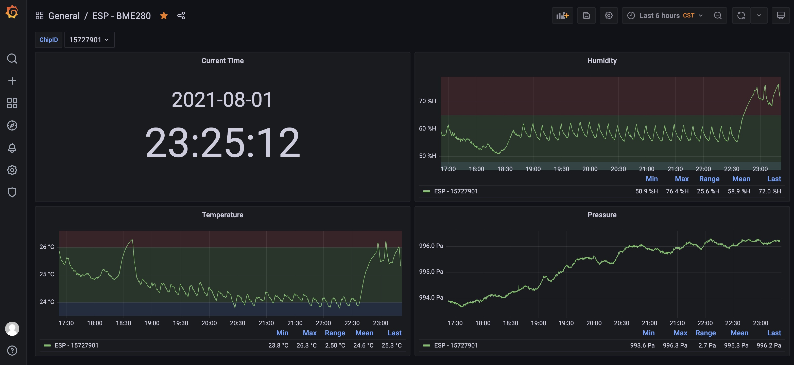
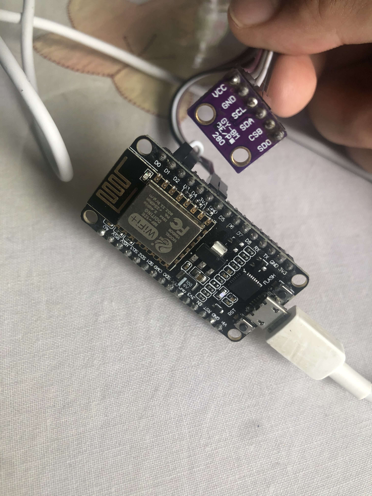

# Smart Home

我家的智能家居 DIY 实践



## 硬件需求

- ESP8266 开发板，因为驱动的问题，我用的是基于 CP2102 芯片的，CH340 的装不上。驱动下载链接：[传送门](https://www.silabs.com/developers/usb-to-uart-bridge-vcp-drivers)

- BME280 湿度大气压传感器，某宝上买的。通过 I2C 通信，引脚连接：
```
VCC - 3V3
GND - GND
SCL - D1
SDA - D2
```



## 项目介绍

我通过 docker-compose 起了 3 个项目：

- emqx: 一个 mqtt 的 broker
- influxdb: 一个时序数据库
- grafana: 一个用于数据展示的平台

工程中有 2 部分代码:

- device/bme280: arduino 代码，读取传感器数据然后 mqtt 发给服务端
- server: 服务端接 mqtt 数据写入 influxdb

## 配置

### emqx

管理平台 http://localhost:18083，默认账户 admin/public

修改 config.json 中的 mqtt.host 为本机 IP

### influxdb

管理平台 http://localhost:8086


配置好修改 config.json 中 influxdb 的相关信息

### grafana

管理平台 http://localhost:3000，默认账户 admin/admin

配置数据源 InfluxDB，面板自定义

## Arduino 项目编译

依赖下面几个库：

- Adafruit_JSON
- Adafruit_MQTT
- Adafruit_BME280

配置 config.h 中 wifi 和 mqtt broker 的相关数据

如果你使用的是 arduino app，直接编译 device 目录下的 Sketch 就行，如果是 arduino-cli，需要自己配一下 arduino-cli.yaml 中的数据，以及 upload.sh 中的串口，然后使用 upload.sh 编译并烧录代码。

## Node Server

切到 server 目录直接 npm run serve 启动服务端
